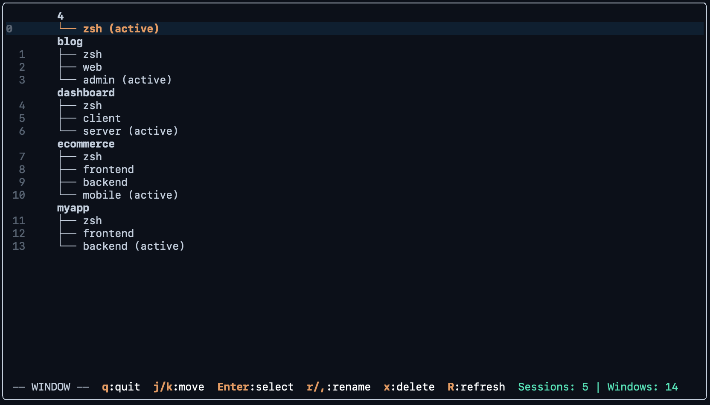
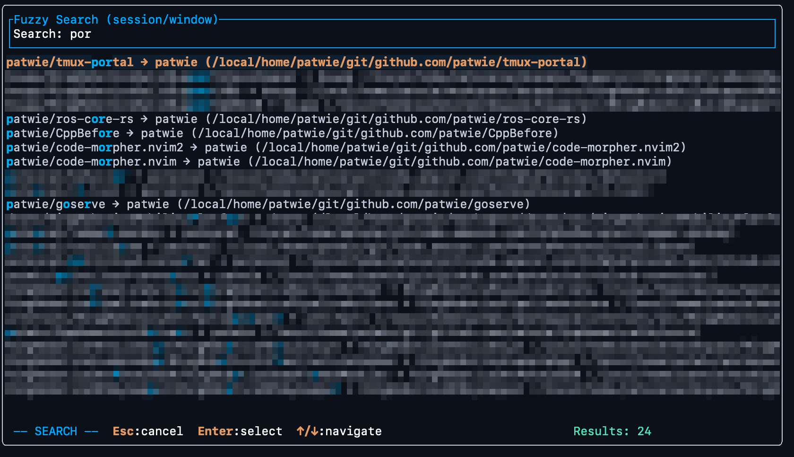

# tmux-portal
> ...because finding the right session shouldn’t be harder than finding Waldo.

tmux-portal is a TUI session manager that makes tmux actually usable. It's what
tmux should have been from the start.

All I wanted was to switch between projects without memorizing cryptic session
names. Then I blinked, and suddenly I had a new Rust TUI and very strong
opinions about terminal navigation. Could've just used `tmux list-sessions`.
Instead I built a fuzzy-finding, tree-viewing, keyboard-driven portal to my
development universe.

You might be wondering: Why build yet another tmux session manager? Why
reinvent the wheel when `tmux ls` exists? Well...

- `tmux list-sessions` shows you a wall of text and expects you to remember
which "work-project-3" was actually the important one.
- `tmux choose-tree` looks like it was designed in 1987. Because it was.
- Switching sessions with `tmux switch -t` requires you to type exact names.
Who has time for that?
- Creating new sessions for projects means manually navigating to directories
and remembering where everything lives.

tmux-portal is simpler! It stays out of your way and does exactly what you
need: browse sessions visually, search through projects, and jump between work
contexts. All with vim-style keybindings. All in a clean TUI. All without
leaving your terminal.



tmux-portal gives you the power of `choose-tree` with the convenience of modern
tooling. It's tmux for humans.

## Features

### Visual Session Tree
- See all your tmux sessions and windows in a clean tree view -- just like choose-tree
- Navigate with vim-style `j/k` keys and make use of relative line numbers
- Numeric prefixes for quick jumps (e.g., `3j` to move down 3 items)
- Current session and active windows are clearly highlighted
- Auto-position on the currently active session/window
- Auto-refresh when tmux state changes

### Smart Search & Discovery
- **Quick Search (`/`)**: Fuzzy search through existing sessions and windows
- **Repository Search (`F`)**: Scan configured directories to create new sessions from projects
- Pattern-based project discovery with flexible directory structures:
  - `{session}/{window}` for simple nested layouts
  - `{session}/src/{window}` for nested project structures
  - Custom patterns for your specific workflow
- Fuzzy matching with highlighted search terms



### Session Management
- **Rename (`r`)**: Rename sessions and windows inline
- **Delete (`x`)**: Remove windows with confirmation prompts
- **Create (`C`)**: Create new windows in the current session
- **Move (`J/K`)**: Reorder sessions and windows
- **Session Mode (`S`)**: Dedicated mode for session-level operations

### Fully Customizable
- Comprehensive color theming for every UI element
- Configurable search paths and patterns
- Adjustable line number formatting
- Custom key bindings and behavior
- TOML-based configuration with sensible defaults

## Configuration

tmux-portal looks for configuration in `~/.config/tmux-portal/config.toml`:

```toml
[[search_patterns]]
# GitHub-style projects: /path/to/git/github.com/user/project
name = "github"
paths = [ "/home/user/git/github.com" ]
pattern = "{session}/{window}"

[[search_patterns]]
# Nested workspace projects: /path/to/workspace/project/src/component
name = "workspace"
paths = [ "/home/user/workspace" ]
pattern = "{session}/src/{window}"

```

## Key Bindings

### Normal Mode
- `j/k` - Navigate up/down
- `Enter` - Switch to selected session/window
- `r` - Rename selected item
- `x` - Delete selected window (with confirmation)
- `R` - Refresh session tree
- `/` - Quick search existing sessions/windows
- `F` - Find and create sessions from projects
- `S` - Enter session management mode
- `C` - Create new window in current session
- `J/K` - Move selected item up/down
- `q` - Quit

### Search Modes
- `Esc` - Cancel search
- `Enter` - Select highlighted result
- `↑/↓` - Navigate search results
- Type to filter results with fuzzy matching

### Session Mode
- `j/k` - Navigate between sessions
- `Enter` - Switch to session
- `r` - Rename session
- `x` - Delete session
- `J/K` - Reorder sessions
- `q/Esc` - Return to normal mode

## Installation

```bash
# Build from source
git clone https://github.com/patwie/tmux-portal.git
cd tmux-portal
cargo build --release

# Copy to your PATH
cp target/release/tmux-portal ~/.local/bin/
```

## Quickstart

```bash
# Start tmux-portal
tmux-portal

# Or create an alias for quick access
echo 'alias tp="tmux-portal"' >> ~/.bashrc

# Set up your configuration
mkdir -p ~/.config/tmux-portal
cp example_config.yaml ~/.config/tmux-portal/config.yaml
# Edit paths and patterns to match your setup
```

## Directory Patterns

tmux-portal supports flexible directory patterns for project discovery:

- `{session}/{window}` - Simple nested: `myproject/frontend`
- `{session}/{window}` - GitHub/GitLab style: `github.com/user/project`
- `{session}/src/{window}` - Source directories: `myproject/src/api`
- Custom patterns with literal directories: `{session}/projects/src/{window}`

When you press `F`, tmux-portal scans your configured paths using these patterns to find potential projects and creates tmux sessions accordingly.


## Tmux Integration

Replace the default tmux session switcher with tmux-portal by adding this to your `.tmux.conf`:

```bash
# Replace the default session/window picker with tmux-portal (~/.tmux.conf)
unbind w
bind w display-popup -d "#{pane_current_path}" -w 50% -h 50% -E "/path/to/tmux-portal"
```

This binds the `w` key to open tmux-portal in a popup window, making session switching seamless and intuitive. Adjust the path to where you installed tmux-portal.
